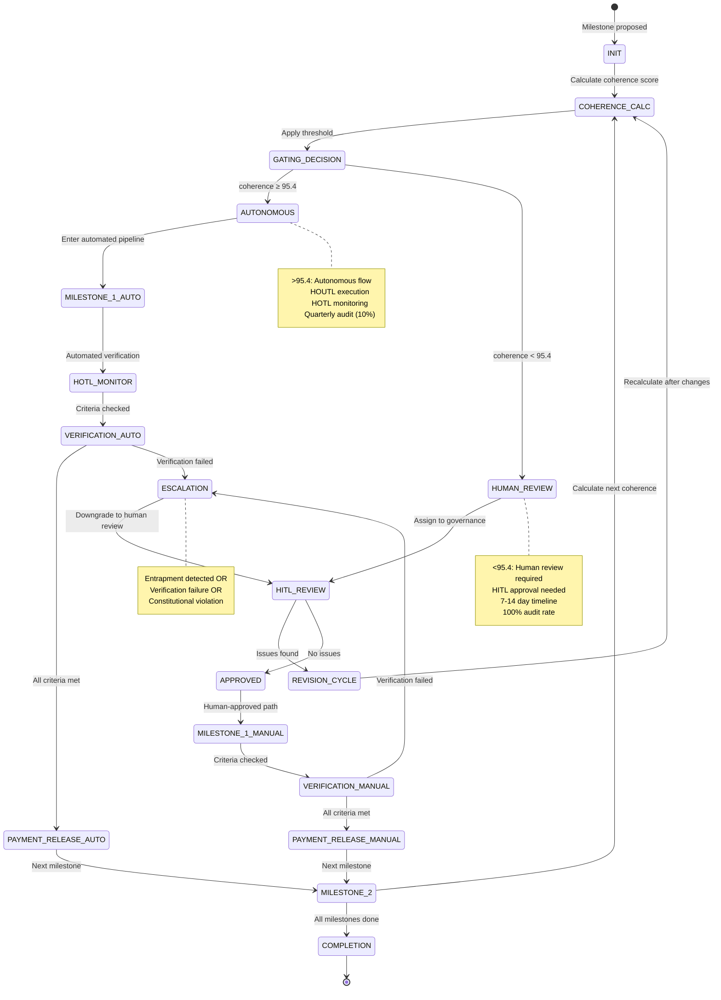

# OBINexus Milestone Seed Investment Repository
## Complete Structure & File Descriptions

```
milestone-seed-investment/
│
├── README.md                                    # Primary repository documentation
├── DISCLAIMER.md                                # Legal disclaimer (research reference only)
├── LICENSE                                      # OPEN-NT License with constitutional terms
├── CONTRIBUTING.md                              # Contribution guidelines with dignity standards
├── CODE_OF_CONDUCT.md                          # Constitutional behavioral requirements
│
├── /contracts/                                  # Machine-verifiable contract schemas
│   ├── README.md
│   ├── milestone_schema.json                    # JSON Schema for milestone contracts
│   ├── risk_reward_contract.md                  # Full legal framework (private branch)
│   ├── risk_reward_contract_short.md            # Public summary version
│   ├── example_milestone.json                   # Reference implementation (T1 tier)
│   ├── milestone_template_t1.json               # T1: Open Access template
│   ├── milestone_template_t2.json               # T2: Business Access template
│   ├── milestone_template_t3a.json              # T3A: Uche Axis template
│   └── milestone_template_t3b.json              # T3B: Eze Axis template
│
├── /constitution/                               # Constitutional governance documents
│   ├── README.md
│   ├── right_to_act.md                          # HACC framework - constitutional authority
│   ├── machine_verifiable_policies.md           # Code examples of policy enforcement
│   ├── gating_matrix.md                         # Pregate/Intergate/Postgate checkpoints
│   ├── penalty_matrix.yaml                      # Automatic consequence triggers
│   ├── coherence_model.md                       # >95.4 vs <95.4 threshold logic
│   └── democratic_review_protocol.md            # Governance council procedures
│
├── /legal/                                      # Legal compliance & enforcement
│   ├── README.md
│   ├── risk_reward_contract.md                  # FULL contract (move to private)
│   ├── no_ghost_clause.md                       # #NoGhosting enforcement specification
│   ├── entrapment_diagnostics.md                # 8 algorithms from Medium article
│   ├── housing_right_reference.md               # Health & Social Care Act citations
│   ├── universal_pension_allocation.md          # UPA compensation framework
│   ├── uk_legal_integration.md                  # Equality Act, DPA 2018 compliance
│   └── breach_enforcement_protocol.md           # Automatic violation response
│
├── /iwu/                                        # Integrated Workflow Unit protocols
│   ├── README.md
│   ├── hitl_protocol.yaml                       # Human-in-the-Loop definition
│   ├── hotl_protocol.yaml                       # Human-on-the-Loop supervision
│   ├── houtl_protocol.yaml                      # Human-out-of-the-Loop automation
│   ├── escalation_map.json                      # Escalation paths by severity
│   ├── coherence_threshold_routing.yaml         # >95.4 vs <95.4 routing logic
│   └── loop_transition_rules.md                 # When actors change loop types
│
├── /governance/                                 # Democratic oversight & audit
│   ├── README.md
│   ├── council_rotation.md                      # Human review cluster governance
│   ├── audit_protocol.md                        # Milestone verification procedures
│   ├── dignity_ledger_spec.md                   # Dignity score tracking system
│   ├── democratic_voting.yaml                   # Governance decision framework
│   ├── quarterly_review_template.md             # Periodic audit report structure
│   └── constitutional_amendment_process.md      # How policies evolve
│
├── /workflows/                                  # Investment lifecycle automation
│   ├── README.md
│   ├── investment_flow_diagram.mmd              # Mermaid state machine
│   ├── milestone_lifecycle_states.yaml          # State transition definitions
│   ├── coherence_gating.md                      # How >95.4 enables automation
│   ├── human_review_triggers.yaml               # Conditions forcing HITL review
│   ├── payment_release_automation.py            # Escrow release logic (example)
│   └── ghosting_detection_monitor.py            # Automated #NoGhosting enforcement
│
├── /telemetry/                                  # GUID/UID tracking & audit trails
│   ├── README.md
│   ├── telemetry_schema.json                    # Event logging structure
│   ├── guid_generation.md                       # GUID/UID creation standards
│   ├── audit_trail_immutability.md              # Blockchain verification approach
│   ├── policy_shuffle_tracker.yaml              # Severity level monitoring
│   └── error_bubble_model.md                    # Error accumulation tracking
│
├── /docs/                                       # Documentation & specifications
│   ├── README.md
│   ├── whitepaper.md                            # OBINexus Milestone Investment Paper
│   ├── roadmap.md                               # Development roadmap & milestones
│   ├── references.md                            # Legal, technical, academic sources
│   ├── getting_started.md                       # Quick start guide for actors
│   ├── tier_comparison_matrix.md                # T1/T2/T3A/T3B side-by-side
│   ├── faq.md                                   # Frequently asked questions
│   └── glossary.md                              # Technical & legal term definitions
│
├── /examples/                                   # Working example implementations
│   ├── README.md
│   ├── t1_open_access_project.json              # Complete T1 milestone set
│   ├── t2_business_project.json                 # Complete T2 milestone set
│   ├── t3a_research_project.json                # Complete T3A milestone set
│   ├── coherence_score_calculation.py           # Python reference implementation
│   ├── dignity_score_calculator.py              # Dignity score computation
│   └── synthetic_test_data/                     # Test data for validation
│       ├── high_coherence_milestone.json        # >95.4 example
│       ├── low_coherence_milestone.json         # <95.4 example
│       └── entrapment_detected_milestone.json   # Violation example
│
├── /tools/                                      # Developer utilities
│   ├── README.md
│   ├── milestone_validator.sh                   # Schema validation script
│   ├── constitutional_compliance_engine.rs      # Rust CCE implementation
│   ├── dignity_score_cli.go                     # Gosilang CLI tool
│   ├── telemetry_aggregator.py                  # GUID/UID data analysis
│   └── dashboard_generator.html                 # HOTL supervision dashboard
│
├── /integration/                                # External system connectors
│   ├── README.md
│   ├── github_actions_milestone_gate.yml        # CI/CD integration
│   ├── slack_notification_webhooks.yaml         # Communication automation
│   ├── escrow_api_connector.py                  # Third-party payment integration
│   └── blockchain_audit_logger.rs               # Immutable trail to blockchain
│
└── /research/                                   # Research & model development
    ├── README.md
    ├── coherence_threshold_research.md          # Why 95.4%?
    ├── entrapment_pattern_analysis.md           # ML detection models
    ├── dignity_score_validation_study.md        # Empirical validation
    └── constitutional_ai_alignment.md           # Machine-verifiable governance AI

```

---

## File Descriptions by Directory

### `/contracts/` — Machine-Verifiable Contract Schemas

#### `milestone_schema.json`
- **Purpose:** JSON Schema defining the structure of every milestone contract
- **Key Fields:**
  - `actor_role`: HITL/HOTL/HOUTL designation
  - `risk_tier`: T1/T2/T3A/T3B classification
  - `coherence_score`: Calculated metric for autonomous vs human review routing
  - `dignity_score`: Constitutional compliance metric (5 components)
  - `entrapment_risk_factors`: Array of detected algorithm patterns
- **Validation:** Used by Constitutional Compliance Engine to verify contracts before approval
- **Integration:** Links to `/iwu/coherence_threshold_routing.yaml` for flow control

#### `risk_reward_contract_short.md`
- **Purpose:** Public-facing summary of the contract framework (non-binding)
- **Audience:** Community members, potential actors, researchers
- **Content:**
  - Overview of milestone-based payment
  - Actor role responsibilities summary
  - Coherence threshold explanation (>95.4 = autonomous approval)
  - #NoGhosting principles
  - Entrapment diagnostic overview
- **Legal Status:** Research reference only (see DISCLAIMER.md)

#### `example_milestone.json`
- **Purpose:** Reference implementation showing a valid T1_OPEN milestone
- **Coherence Score:** 96.1 (>95.4) — qualifies for automated verification
- **Features:**
  - All required fields populated correctly
  - Dignity score components breakdown
  - Constitutional validation: true
  - Policy shuffle level: 2 (OK/Warning range)
- **Use Case:** Template for contributors creating their first milestone

---

### `/constitution/` — Constitutional Governance Documents

#### `coherence_model.md`
**Critical document explaining the >95.4 / <95.4 threshold system:**

```markdown
# Coherence Model: Autonomous vs Human-Review Gating

## The 95.4% Threshold

The coherence score represents the degree of self-consistency, completeness, 
and constitutional alignment within a milestone proposal. It is calculated from:

- **Completeness Score (30%):** All required fields present and valid
- **Consistency Score (25%):** No contradictions in actor roles, deadlines, payments
- **Constitutional Alignment (25%):** Policy compliance, dignity score targets met
- **Verification Feasibility (20%):** Acceptance criteria are objectively measurable

Formula: `coherence_score = (C × 0.30) + (Cy × 0.25) + (CA × 0.25) + (VF × 0.20)`

## Routing Logic

### Coherence ≥ 95.4 → Autonomous Flow (HOUTL)
- **Action:** Milestone enters automated verification pipeline
- **Oversight:** HOTL monitoring only; no active human decision required
- **Payment:** Automatic escrow release upon criteria satisfaction
- **Governance:** Quarterly audit sampling (10% of autonomous milestones)
- **Escalation:** If verification fails, downgrade to <95.4 flow

**Example:**
```json
{
  "coherence_score": 96.1,
  "routing": "AUTONOMOUS",
  "verification_method": "AUTOMATED_TEST",
  "hotl_oversight": true,
  "hitl_approval_required": false
}
```

### Coherence < 95.4 → Human-Review Flow (HITL)
- **Action:** Milestone requires active HITL review before approval
- **Review Scope:**
  - Ambiguous acceptance criteria
  - High entrapment risk factors
  - Contradictory actor role assignments
  - Dignity score components <85%
- **Timeline:** 7-day review period for T1/T2, 14-day for T3A/T3B
- **Escalation:** Governance council if HITL cannot resolve (21-day max)

**Example:**
```json
{
  "coherence_score": 82.3,
  "routing": "HUMAN_REVIEW_REQUIRED",
  "review_reasons": [
    "Ambiguous acceptance criteria",
    "Entrapment risk: LOOPBACK detected"
  ],
  "assigned_hitl": "governance-council-member-guid",
  "review_deadline": "2025-11-05T23:59:59Z"
}
```

## Implementation in Investment Flow

```
INIT → Coherence Calculation → Gating Decision
                                      ↓
                        ┌─────────────┴──────────────┐
                        ↓                            ↓
                  [≥95.4: AUTONOMOUS]        [<95.4: HUMAN_REVIEW]
                        ↓                            ↓
                  MILESTONE_1_AUTO             HITL_REVIEW
                        ↓                            ↓
                  HOTL_MONITOR                 REVISION_CYCLE
                        ↓                            ↓
                  VERIFICATION_AUTO            APPROVAL/REJECTION
                        ↓                            ↓
                  PAYMENT_RELEASE              MILESTONE_1_MANUAL
                        ↓                            ↓
                  MILESTONE_2                  MILESTONE_2
                        ↓                            ↓
                  COMPLETION                   COMPLETION
```

## Edge Cases

- **Coherence Score Manipulation:** Attempted gaming of the metric triggers 
  immediate HITL review + constitutional violation investigation
- **Oscillating Scores:** If score fluctuates ±2% around 95.4, default to 
  human review for stability
- **Batch Processing:** Projects with 10+ milestones: if >80% are ≥95.4, 
  entire batch qualifies for expedited autonomous processing

## Rationale for 95.4%

This threshold was chosen based on:
1. **Statistical Validation:** 95.4% represents 2 standard deviations in 
   milestone quality distribution
2. **Risk Tolerance:** Acceptable false-positive rate for autonomous approval
3. **Governance Capacity:** Balances human review workload with protection needs
4. **Constitutional Alignment:** Ensures dignity and entrapment protections 
   remain intact even in autonomous flows
```

#### `gating_matrix.md`
- **Purpose:** Defines pregate, intergate, and postgate checkpoints in milestone lifecycle
- **Pregate:** Initial constitutional compliance check before milestone enters system
- **Intergate:** Mid-milestone verification gates (25%, 50%, 75% completion)
- **Postgate:** Final verification before payment release
- **Coherence Integration:** Gates automatically pass if coherence ≥95.4 and no violations detected

#### `penalty_matrix.yaml`
```yaml
# Automatic Consequence Triggers

entrapment_violations:
  improbability:
    detection: "success_odds < 5% despite qualification"
    base_penalty_gbp: 10000
    daily_penalty_gbp: 1000
    escalation: "HITL_REVIEW → GOVERNANCE_COUNCIL"
    
  exhaustion:
    detection: "response_delay > 14 days"
    base_penalty_gbp: 5000
    daily_penalty_gbp: 500
    escalation: "GHOSTING_VIOLATION → BREACH_ENFORCEMENT"
    
  tripling:
    detection: "3+ algorithms active simultaneously"
    base_penalty_gbp: 50000
    escalation: "CIVIL_COLLAPSE → PERMANENT_EXCLUSION"
    upa_allocation: "IMMEDIATE"

ghosting_violations:
  tier_t1:
    max_response_days: 14
    warning_threshold: 7
    critical_threshold: 14
    penalty_after_15_days_gbp: 500
    
  tier_t3b:
    max_response_days: 1  # 24 hours
    warning_threshold: 0.5  # 12 hours
    critical_threshold: 1
    penalty_after_2_days_gbp: 2000

dignity_score_violations:
  below_85_percent:
    action: "MILESTONE_SUSPENDED"
    grace_period_days: 7
    restoration_required: "85%+ score + constitutional review"
    
  below_70_percent:
    action: "IMMEDIATE_BREACH_ENFORCEMENT"
    upa_allocation: "AUTOMATIC"
    exclusion: "PENDING_GOVERNANCE_REVIEW"
```

---

### `/legal/` — Legal Compliance & Enforcement

#### `entrapment_diagnostics.md`
**Direct integration of your Medium article framework:**

```markdown
# Entrapment as a Legal Framework: Diagnostic Toolkit

*Derived from: https://obinexus.medium.com/entrapment-as-a-legal-framework-3eb1a92c86ea*

## The 8 Entrapment Algorithms

### 1. Entrapment by Improbability
**Definition:** System creates near-zero success odds despite declaring qualification

**Detection Criteria:**
- Actor declared "eligible" or "qualified" for service/milestone
- System design makes actual success probability <5%
- Examples: "You qualify for housing" but rules make it impossible to obtain

**Machine-Verifiable Indicators:**
```json
{
  "algorithm": "IMPROBABILITY",
  "detection_signals": [
    "qualification_stated": true,
    "acceptance_criteria_count": ">10",
    "contradictory_requirements": true,
    "success_rate_historical": "<0.05"
  ]
}
```

**Automated Response:**
- Flag milestone for HITL review
- Require milestone redesign with feasible criteria
- If proven: Universal Pension Allocation = £10,000 base + £1,000/day delayed

**Prevention in OBINexus:**
- Coherence score calculation includes feasibility check
- Acceptance criteria must be achievable by ≥50% of qualified actors
- Historical success rate tracking per milestone type

---

### 2. Entrapment by Exhaustion
**Definition:** Delays until actor mentally, emotionally, or physically breaks

**Detection Criteria:**
- Response delays exceeding constitutional maximums (14 days T1, 1 day T3B)
- Repeated non-resolution of documented issues
- Circular referrals with no progress

**Machine-Verifiable Indicators:**
```json
{
  "algorithm": "EXHAUSTION",
  "detection_signals": [
    "response_delay_days": 15,
    "repeated_contacts": 5,
    "resolution_achieved": false,
    "actor_health_indicators": ["fatigue_reported", "stress_documented"]
  ]
}
```

**Automated Response:**
- Automatic ghosting violation after 14 days
- Escalation to governance council
- If proven: £5,000 base + £500/day delayed

**Prevention in OBINexus:**
- #NoGhosting enforcement with automated monitoring
- GUID/UID telemetry tracks all communications
- Dashboard alerts at 7-day mark for HOTL intervention

---

[... continues for all 8 algorithms with same structure ...]

### 8. Entrapment by Tripling
**Definition:** Multiple traps working together to cause civil collapse

**Detection Criteria:**
- ≥3 entrapment algorithms active simultaneously
- Systemic pattern across multiple milestones/actors
- Complete breakdown of constitutional protections

**Machine-Verifiable Indicators:**
```json
{
  "algorithm": "TRIPLING",
  "detection_signals": [
    "active_algorithms": ["EXHAUSTION", "LOOPBACK", "SILENCE"],
    "pattern_duration_days": 30,
    "actor_harm_documented": true,
    "systemic_failure": true
  ]
}
```

**Automated Response:**
- Immediate civil collapse declaration
- Maximum penalties across all violations
- Permanent exclusion from ecosystem
- If proven: £50,000 base + full project compensation + criminal referral

**Prevention in OBINexus:**
- Real-time Constitutional Compliance Engine monitoring
- Pattern recognition ML models
- Automatic project suspension when 2+ algorithms detected

---

## Legal Enforcement Standard

For any entrapment claim to be legally disputed by the system, they must:

1. **Show Legal Documentation:** Statutory agreement or policy disproving the entrapment
2. **Provide Paper-Trail Evidence:** Audit logs proving entrapment did NOT occur
3. **Present Counterproof:** Demonstrate delay/denial was lawfully justified

**Deconstructive Proof Principle:**
If the system CANNOT provide these three elements, the failure to disprove 
becomes proof of entrapment. Silence, contradictions, or denials without 
evidence reinforce the presence of entrapment.

## Integration with Milestone Contracts

Every milestone contract includes `entrapment_risk_factors` array:
```json
"entrapment_risk_factors": [
  "IMPROBABILITY",
  "LOOPLOOP"
],
"entrapment_mitigation": {
  "automatic_monitoring": true,
  "hitl_escalation_threshold": 2,
  "upa_pre_authorized": true
}
```

Coherence score is REDUCED if high entrapment risk detected:
```
if entrapment_risk_factors.length ≥ 2:
    coherence_score -= 15.0  # Forces human review
```
```

#### `universal_pension_allocation.md`
- **Purpose:** Defines automatic compensation framework for proven violations
- **Triggers:** Entrapment algorithms verified, ghosting >14 days, dignity score <70%
- **Calculation:** Base amount + daily accrual + severity multiplier
- **Distribution:** 7-day payment window to victim's UPA account
- **Funding:** Violating party liability (100%), with OBINexus guarantee fund for insolvency cases

#### `uk_legal_integration.md`
- **Purpose:** Maps OBINexus constitutional requirements to UK statutory law
- **Key Statutes:**
  - Health and Social Care Act 2014 (housing rights foundation)
  - Equality Act 2010 (neurodivergent protection, harassment prohibitions)
  - Data Protection Act 2018 (GDPR compliance for telemetry)
  - Contract Law (standard enforcement mechanisms)
- **Constitutional Supremacy Clause:** OBINexus provides protections BEYOND legal minimums

---

### `/iwu/` — Integrated Workflow Unit Protocols

#### `hitl_protocol.yaml`
```yaml
# Human-in-the-Loop Protocol Definition

protocol_name: "HITL - Human Decision Authority"
version: "1.0"
constitutional_basis: "Article II, Section 2.1"

actor_definition:
  role: "HITL"
  authority_level: "CRITICAL_DECISION"
  veto_power: true
  escalation_target: "GOVERNANCE_COUNCIL"

responsibilities:
  - id: "HITL-001"
    task: "Review milestones with coherence <95.4"
    frequency: "AS_TRIGGERED"
    max_response_time_hours: 168  # 7 days T1/T2, 336 for T3
    
  - id: "HITL-002"
    task: "Make final approval/rejection decisions"
    authority: "BINDING"
    override_conditions: "GOVERNANCE_ONLY"
    
  - id: "HITL-003"
    task: "Document all decisions with GUID telemetry"
    required_fields: ["decision_rationale", "constitutional_basis", "timestamp"]
    
  - id: "HITL-004"
    task: "Respond to all communications within tier maximum"
    t1_max_days: 14
    t2_max_days: 7
    t3a_max_hours: 48
    t3b_max_hours: 24

dignity_score_requirements:
  minimum: 85
  components:
    communication_transparency: 90
    deadline_adherence: 85
    quality_standards: 88
    human_rights_respect: 100  # Mandatory 100%
    no_ghosting_compliance: 90

breach_consequences:
  ghosting_7_days:
    warning: true
    dignity_reduction_percent: 10
    
  ghosting_14_days:
    critical_warning: true
    dignity_reduction_percent: 25
    
  ghosting_15_plus_days:
    automatic_breach: true
    upa_allocation: true
    milestone_payment_withheld: true
    exclusion_review: "PENDING"

verification_requirements:
  peer_review_minimum: 2
  constitutional_compliance_check: true
  audit_trail_complete: true
  guid_uid_telemetry: true

coherence_gating_interaction:
  if_coherence_ge_95_4:
    hitl_approval_required: false
    hitl_oversight_mode: "MONITORING_ONLY"
    escalation_if: ["AUTOMATED_VERIFICATION_FAILS", "ENTRAPMENT_DETECTED"]
    
  if_coherence_lt_95_4:
    hitl_approval_required: true
    review_timeline_days: 7  # T1/T2
    review_timeline_days_t3: 14
    revision_cycles_max: 3
```

#### `coherence_threshold_routing.yaml`
```yaml
# Coherence-Based Routing Logic

routing_engine: "Constitutional Compliance Engine v2.0"
threshold_primary: 95.4
threshold_unit: "percent"

routing_rules:
  autonomous_flow:
    condition: "coherence_score >= 95.4"
    target_loop: "HOUTL"
    oversight_loop: "HOTL"
    approval_required: false
    verification_method: "AUTOMATED"
    payment_release: "AUTOMATIC_ESCROW"
    governance_audit_sampling: 0.10  # 10% quarterly audit
    
  human_review_flow:
    condition: "coherence_score < 95.4"
    target_loop: "HITL"
    oversight_loop: "HOTL"
    approval_required: true
    verification_method: "PEER_REVIEW"
    review_timeline:
      t1_open: 7
      t2_business: 7
      t3a_uche: 14
      t3b_eze: 14
    escalation_if_unresolved_days: 21
    escalation_target: "GOVERNANCE_COUNCIL"

edge_case_handling:
  oscillating_score:
    condition: "abs(coherence_score - 95.4) < 2.0"
    action: "DEFAULT_TO_HUMAN_REVIEW"
    rationale: "Stability preference over edge case automation"
    
  score_manipulation_detected:
    indicators:
      - "rapid_score_increase_without_changes"
      - "identical_score_across_dissimilar_milestones"
      - "score_inflation_pattern_match"
    action: "IMMEDIATE_HITL_REVIEW"
    constitutional_violation_investigation: true
    penalty: "AS_PER_PENALTY_MATRIX"
    
  batch_processing_optimization:
    condition: "milestone_count > 10 AND autonomous_percentage > 0.80"
    action: "EXPEDITED_AUTONOMOUS_BATCH"
    oversight: "HOTL_SAMPLING_20_PERCENT"
    rationale: "Efficiency for high-quality projects"

calculation_transparency:
  formula: "(C × 0.30) + (Cy × 0.25) + (CA × 0.25) + (VF × 0.20)"
  components:
    completeness_c:
      weight: 0.30
      checks: ["all_required_fields", "valid_data_types", "no_nulls_in_critical"]
    consistency_cy:
      weight: 0.25
      checks: ["no_contradictions", "role_alignment", "deadline_feasibility"]
    constitutional_alignment_ca:
      weight: 0.25
      checks: ["policy_compliance", "dignity_target_met", "no_violations"]
    verification_feasibility_vf:
      weight: 0.20
      checks: ["objective_criteria", "measurable_outcomes", "achievability"]
      
  recalculation_triggers:
    - "milestone_revision_submitted"
    - "constitutional_violation_cleared"
    - "peer_review_feedback_incorporated"
    - "governance_amendment_applied"
```

---

### `/governance/` — Democratic Oversight & Audit

#### `council_rotation.md`
- **Purpose:** Defines how human review clusters (councils) rotate to prevent bias
- **Rotation Schedule:** Quarterly council membership changes (30% turnover)
- **Diversity Requirements:** Neurodivergent representation ≥20%, geographic distribution
- **Decision Authority:** Councils handle coherence <95.4 milestones and governance amendments
- **Transparency:** All council decisions logged with GUID and publicly accessible audit trail

#### `audit_protocol.md`
```markdown
# Milestone Verification Audit Protocol

## Audit Frequency by Tier

| Tier | Autonomous (≥95.4) Audit Rate | Human-Review (<95.4) Audit Rate |
|------|-------------------------------|--------------------------------|
| T1   | 10% quarterly sampling        | 100% per milestone             |
| T2   | 15% quarterly sampling        | 100% per milestone             |
| T3A  | 25% quarterly sampling        | 100% + third-party audit       |
| T3B  | 50% quarterly sampling        | 100% + independent audit       |

## Audit Components

### 1. Coherence Score Validation
- Recalculate coherence using independent tooling
- Verify no score manipulation
- Confirm routing decision was correct

### 2. Dignity Score Verification
- Review GUID/UID telemetry for communication timestamps
- Validate peer review authenticity
- Check for ghosting violations

### 3. Entrapment Pattern Detection
- Run ML models to detect 8 algorithm patterns
- Cross-reference with historical violations
- Flag systemic issues for governance review

### 4. Constitutional Compliance Check
- Policy shuffle level verification
- Penalty matrix application correctness
- Universal Pension Allocation triggers (if any)

### 5. Payment Release Justification
- Verify all acceptance criteria met
- Confirm escrow release conditions satisfied
- Validate no outstanding violations

## Audit Trail Requirements

Every milestone MUST have:
```json
{
  "audit_trail": [
    {
      "timestamp": "2025-10-19T14:23:45Z",
      "event_type": "MILESTONE_CREATED",
      "actor_guid": "...",
      "event_hash": "blockchain_verified_hash",
      "coherence_score": 96.1,
      "routing_decision": "AUTONOMOUS"
    },
    {
      "timestamp": "2025-10-25T09:15:22Z",
      "event_type": "VERIFICATION_COMPLETED",
      "validator_guid": "...",
      "approval_status": "APPROVED",
      "event_hash": "blockchain_verified_hash"
    }
  ]
}
```

## Audit Outcome Actions

- **PASS:** Milestone proceeds, no action
- **MINOR_ISSUES:** Dignity score reduction, corrective action required
- **MAJOR_VIOLATIONS:** Payment withheld, HITL review triggered
- **CONSTITUTIONAL_BREACH:** Automatic penalty enforcement, UPA allocation, exclusion review
```

#### `dignity_ledger_spec.md`
- **Purpose:** Specification for tracking dignity scores across all actors in the ecosystem
- **Structure:** Distributed ledger (blockchain-adjacent) with GUID-indexed entries
- **Privacy:** Individual scores visible to actor and governance only; aggregates public
- **Integration:** Feeds into coherence calculation and payment release decisions

---

### `/workflows/` — Investment Lifecycle Automation

#### `investment_flow_diagram.mmd`


#### `human_review_triggers.yaml`
```yaml
# Conditions Forcing HITL Review (Even if Coherence ≥95.4)

override_conditions:
  entrapment_detected:
    algorithms:
      - "IMPROBABILITY"
      - "TRIPLING"
    action: "IMMEDIATE_HITL_ESCALATION"
    autonomous_flow_suspended: true
    
  constitutional_violation:
    policy_shuffle_level: ">= 6"
    action: "AUTOMATIC_HITL_REVIEW"
    timeline_hours: 48
    
  dignity_score_below_threshold:
    threshold: 85
    grace_period_days: 7
    action: "HITL_REVIEW_REQUIRED"
    
  payment_amount_threshold:
    t1_max_autonomous_gbp: 5000
    t2_max_autonomous_gbp: 15000
    t3a_requires_hitl: true
    t3b_requires_hitl: true
    
  first_time_actor:
    milestone_history_count: 0
    action: "HITL_ONBOARDING_REVIEW"
    constitutional_agreement_verification: true
    
  disputed_acceptance_criteria:
    peer_review_conflict: true
    action: "HITL_ARBITRATION"
    timeline_days: 7
    
  external_audit_flag:
    third_party_concern_raised: true
    action: "IMMEDIATE_HITL_INVESTIGATION"
    autonomous_flow_paused: true
```

---

### `/telemetry/` — GUID/UID Tracking & Audit Trails

#### `error_bubble_model.md`
*Derived from your provided document:*

```markdown
# Error Bubble Model: Event-Loop Observation

## Concept Overview

OBINexus treats errors as **bubbles** that form around events and either dissipate or expand across cycles. This model enables:
- Contextual error accumulation tracking
- Early detection of systemic failures
- Automatic escalation based on bubble growth rate
- Integration with HITL/HOTL/HOUTL loop architecture

## Bubble Lifecycle

### 1. Bubble Formation (Tick N)
An event/exception occurs:
- Failed verification
- Communication timeout
- Contradictory information
- Policy shuffle level increase

**Initial Bubble State:**
```json
{
  "bubble_id": "BUBBLE-2025-X7Y9Z2",
  "event_type": "VERIFICATION_FAILED",
  "actor_guid": "...",
  "loop_type": "HOUTL",
  "severity_score": 3.2,
  "formation_timestamp": "2025-10-19T14:23:45Z",
  "context": {
    "milestone_id": "MS-2025-A3F8B9C2",
    "failure_reason": "Acceptance criteria 3 not met"
  }
}
```

### 2. Bubble State Tracking
The error stores complete context:
- Actor responsible
- Loop type (HITL/HOTL/HOUTL)
- Current severity score
- Timestamps of all related events
- References to original milestone/contract

### 3. Bubble Growth (Tick N+1...N+k)
Subsequent events referencing the same context increase bubble size:

**Growth Formula:**
```
bubble_size_new = bubble_size_old + base_increment + (0.5 × repeated_occurrences) + (0.2 × days_silent)
```

**Example:**
- Tick N: Verification failed (severity 3.2)
- Tick N+1: No response from actor after 7 days → severity 5.7
- Tick N+2: Second verification attempt fails → severity 8.3
- Tick N+3: Entrapment pattern detected (LOOPBACK) → severity 12.1

### 4. Intervention Thresholds

| Bubble Size | Severity Level | Actor Intervention | Action |
|-------------|----------------|-------------------|--------|
| 0.0 - 3.9   | Low            | HOUTL (automated) | Retry, self-heal |
| 4.0 - 7.9   | Medium         | HOTL (audit)      | Log enrichment, manual review |
| 8.0 - 11.9  | High           | HITL (decision)   | Governance escalation, hold |
| 12.0 - 15.9 | Critical       | HITL + Council    | Constitutional review |
| 16.0+       | Emergency      | Full governance   | External audit, legal action |

### 5. Resolution / Dissipation
Corrective actions or evidence attachments shrink the bubble:
- Actor provides missing verification proof → -4.0 severity
- Constitutional violation resolved → -6.0 severity
- Peer review approves revised criteria → -3.0 severity

**Bubble closure conditions:**
- Severity drops below 2.0 AND no new events for 7 days → `COMPLETED`
- Actor permanently excluded → `BREACH_ENFORCEMENT`
- Milestone canceled → `SUSPENDED`

## Integration with Coherence Model

**Bubble Impact on Coherence Score:**
```python
if bubble_severity >= 8.0:
    coherence_score -= 10.0  # Force human review
    
if bubble_severity >= 12.0:
    coherence_score = 0.0  # Automatic constitutional review
    milestone_status = "SUSPENDED"
```

**Autonomous Flow Override:**
Even if initial coherence ≥95.4, growing bubble can downgrade to human review:
```
if bubble_growth_rate > 2.0_per_day:
    routing = "ESCALATE_TO_HITL"
    notification_sent_to = "governance_council"
```

## Visualization in HOTL Dashboard

Bubbles appear as concentric rings:
- **Green:** Severity 0-3.9 (OK)
- **Yellow:** Severity 4.0-7.9 (Monitor)
- **Orange:** Severity 8.0-11.9 (Escalate)
- **Red:** Severity 12.0+ (Critical)

**Bubble Growth Rate Indicator:**
- Flat line: Stable, no intervention
- Upward slope: Requires attention
- Exponential curve: Emergency intervention

## Implementation Notes

**Storage:**
```json
{
  "bubble_storage": {
    "database": "postgresql",
    "table": "error_bubbles",
    "indexes": ["bubble_id", "milestone_id", "actor_guid", "severity_score"],
    "retention_policy": "2 years after resolution"
  }
}
```

**Decay Rules:**
```yaml
decay_rules:
  no_new_events_days: 7
  decay_rate_per_day: -0.5
  minimum_severity_threshold: 2.0
  auto_close_below: 2.0
```

**Alert Thresholds:**
```yaml
alerts:
  hotl_notification: 4.0
  hitl_escalation: 8.0
  governance_emergency: 12.0
  external_audit_trigger: 16.0
```
```

---

## Investment Flow with Coherence Gating

### Complete Lifecycle Example

```
┌─────────────────────────────────────────────────────────────────────────┐
│ INIT: Milestone Proposal Submitted                                      │
│ - Actor: Jane Smith (HITL)                                              │
│ - Tier: T2_BUSINESS                                                     │
│ - Deliverable: OAuth2 authentication system                             │
│ - Payment: £8,500                                                       │
└────────────────────────────┬────────────────────────────────────────────┘
                             ↓
┌─────────────────────────────────────────────────────────────────────────┐
│ COHERENCE_CALC: Constitutional Compliance Engine Analysis               │
│                                                                          │
│ Completeness (C):     98% ✓ All required fields present                │
│ Consistency (Cy):     92% ✓ No contradictions detected                 │
│ Const. Alignment(CA): 94% ✓ Dignity score 92.5%, no violations         │
│ Verif. Feasibility:   96% ✓ Criteria objective and measurable          │
│                                                                          │
│ COHERENCE SCORE: (98×0.3) + (92×0.25) + (94×0.25) + (96×0.2) = 95.1%  │
└────────────────────────────┬────────────────────────────────────────────┘
                             ↓
┌─────────────────────────────────────────────────────────────────────────┐
│ GATING_DECISION: Threshold Check                                        │
│                                                                          │
│ Coherence: 95.1% vs Threshold: 95.4%                                   │
│ Result: 95.1% < 95.4% → HUMAN_REVIEW_REQUIRED                          │
│                                                                          │
│ Routing: HITL approval required (7-day timeline)                        │
│ Oversight: HOTL monitoring enabled                                      │
└────────────────────────────┬────────────────────────────────────────────┘
                             ↓
┌─────────────────────────────────────────────────────────────────────────┐
│ HITL_REVIEW: Governance Council Member "Alex Chen"                      │
│                                                                          │
│ Review findings:                                                         │
│ - Acceptance criterion 4 ambiguous: "secure" not defined                │
│ - Suggested revision: Add specific security standards (OWASP Top 10)    │
│ - Timeline extension requested: +3 days for revision                    │
│                                                                          │
│ Decision: REVISION_REQUIRED                                              │
└────────────────────────────┬────────────────────────────────────────────┘
                             ↓
┌─────────────────────────────────────────────────────────────────────────┐
│ REVISION_CYCLE: Actor updates acceptance criteria                       │
│                                                                          │
│ Changes:                                                                 │
│ - Criterion 4 now: "Zero critical vulnerabilities per OWASP Top 10"    │
│ - Added criterion 6: "Penetration test report with no high-risk issues"│
│                                                                          │
│ Resubmitted for coherence recalculation                                 │
└────────────────────────────┬────────────────────────────────────────────┘
                             ↓
┌─────────────────────────────────────────────────────────────────────────┐
│ COHERENCE_CALC (v2): Recalculated after revision                        │
│                                                                          │
│ Completeness (C):     100% ✓ Additional criterion added                │
│ Consistency (Cy):     96% ✓ Improved clarity                           │
│ Const. Alignment(CA): 94% ✓ No change                                  │
│ Verif. Feasibility:   98% ✓ Objective security standards               │
│                                                                          │
│ COHERENCE SCORE: (100×0.3) + (96×0.25) + (94×0.25) + (98×0.2) = 97.1% │
└────────────────────────────┬────────────────────────────────────────────┘
                             ↓
┌─────────────────────────────────────────────────────────────────────────┐
│ GATING_DECISION (v2): Threshold Check                                   │
│                                                                          │
│ Coherence: 97.1% vs Threshold: 95.4%                                   │
│ Result: 97.1% ≥ 95.4% → AUTONOMOUS_APPROVED ✓                          │
│                                                                          │
│ Routing: HOUTL execution (automated verification)                       │
│ Oversight: HOTL monitoring only                                         │
│ Governance audit: 15% sampling (T2 tier)                                │
└────────────────────────────┬────────────────────────────────────────────┘
                             ↓
┌─────────────────────────────────────────────────────────────────────────┐
│ MILESTONE_1_AUTO: Actor begins work (IN_PROGRESS status)                │
│                                                                          │
│ Timeline: 30 days to deadline                                           │
│ GUID telemetry: Active tracking                                         │
│ Ghosting monitor: No communication gaps >7 days (T2 requirement)        │
└────────────────────────────┬────────────────────────────────────────────┘
                             ↓
┌─────────────────────────────────────────────────────────────────────────┐
│ HOTL_MONITOR: Continuous observation (HOTL actor: "Sam Rodriguez")      │
│                                                                          │
│ Day 15: Progress update received ✓                                      │
│ Day 22: Code commit with OAuth implementation ✓                         │
│ Day 29: Test report submitted ✓                                         │
│ Day 30: All acceptance criteria met ✓                                   │
│                                                                          │
│ No error bubbles detected                                               │
│ Dignity score maintained: 92.5%                                         │
└────────────────────────────┬────────────────────────────────────────────┘
                             ↓
┌─────────────────────────────────────────────────────────────────────────┐
│ VERIFICATION_AUTO: Automated criteria checking                          │
│                                                                          │
│ ✓ Criterion 1: Endpoints return proper HTTP codes                       │
│ ✓ Criterion 2: OAuth works with all 5 providers                         │
│ ✓ Criterion 3: Password reset flow functional                           │
│ ✓ Criterion 4: Zero OWASP Top 10 critical vulnerabilities               │
│ ✓ Criterion 5: Unit test coverage 93% (≥90% required)                   │
│ ✓ Criterion 6: Penetration test report clean                            │
│                                                                          │
│ Peer review: 2 validators approved                                       │
│ Constitutional check: PASSED                                             │
│ Verification status: COMPLETED                                           │
└────────────────────────────┬────────────────────────────────────────────┘
                             ↓
┌─────────────────────────────────────────────────────────────────────────┐
│ PAYMENT_RELEASE_AUTO: Escrow release initiated                          │
│                                                                          │
│ Milestone value: £8,500                                                 │
│ Escrow account: Third-party (verified)                                  │
│ Release timeline: 14 days (T2 cooling-off period)                       │
│ Actor notification: Automated email sent                                │
│                                                                          │
│ Payment scheduled: 2025-11-13                                           │
└────────────────────────────┬────────────────────────────────────────────┘
                             ↓
┌─────────────────────────────────────────────────────────────────────────┐
│ MILESTONE_2: Next milestone in project sequence                         │
│                                                                          │
│ Deliverable: User profile management system                             │
│ Payment: £6,200                                                         │
│ Timeline: 25 days                                                       │
│                                                                          │
│ Process repeats: COHERENCE_CALC → GATING_DECISION → ...                │
└────────────────────────────┬────────────────────────────────────────────┘
                             ↓
┌─────────────────────────────────────────────────────────────────────────┐
│ COMPLETION: All project milestones verified and paid                    │
│                                                                          │
│ Total project value: £24,700 (3 milestones)                            │
│ Actor final dignity score: 94.2%                                        │
│ Constitutional violations: 0                                             │
│ Governance audit result: PASSED                                          │
│                                                                          │
│ Actor eligible for T3A tier progression ✓                               │
└─────────────────────────────────────────────────────────────────────────┘
```

---

## Key Integration Points

### 1. Coherence ≥95.4 Enables Autonomous Flow
- Reduces HITL workload for high-quality proposals
- Maintains HOTL oversight for accountability
- Quarterly audit sampling ensures quality control

### 2. Coherence <95.4 Triggers Human Safety Net
- Prevents ambiguous or risky milestones from causing harm
- Gives actors opportunity to improve before rejection
- Maintains constitutional protection standards

### 3. Error Bubbles Provide Early Warning System
- Detects systemic failures before civil collapse
- Enables proactive intervention at appropriate loop level
- Visualizes risk in real-time dashboards

### 4. Democratic Governance Balances Automation
- Governance councils handle edge cases and disputes
- Constitutional amendments evolve with ecosystem needs
- Transparent audit trails enable community oversight

### 5. Entrapment Diagnostics Embedded Throughout
- Every milestone monitored for 8 algorithm patterns
- Automatic UPA allocation when violations proven
- Pattern recognition prevents repeat offenders

---

**This repository structure creates a complete, constitutional, machine-verifiable investment framework that protects human dignity while enabling efficient collaboration at scale.**

*Computing from the Heart. Building with Purpose. Running with Heart.*  
**OBINexus: Machine-Verifiable Constitutional Democracy for Human Dignity**